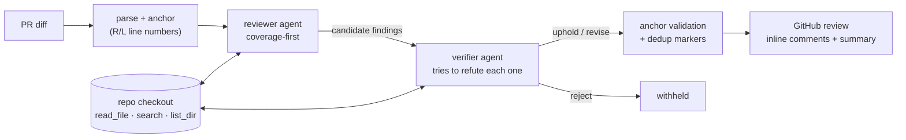

# Momus

> In Greek myth, Momus criticized the gods so honestly they threw him off
> Olympus. This one only posts criticism that survives cross-examination.

[](https://github.com/Vincent-P-essy/momus/actions/workflows/ci.yml)
[](https://github.com/Vincent-P-essy/momus/blob/main/pyproject.toml)
[](https://github.com/Vincent-P-essy/momus/blob/main/pyproject.toml)
[](https://github.com/astral-sh/ruff)
[](LICENSE)

Momus is an AI code-review agent for GitHub pull requests. Point it at a PR
and it investigates the repository like a senior engineer — reading the code
around every hunk, searching for the project's own conventions, checking
callers — then drafts findings that must survive an **adversarial
verification pass** before a single comment reaches the PR.

## Why another AI reviewer?

Most LLM reviewers fail the same way, and it isn't missed bugs — it's noise.
Enough wrong or trivial comments and the team stops reading, then turns the
bot off. Two structural causes:

1. **They judge the diff without the repository.** A diff can't tell you that
   the "missing" validation lives one call up, or that the "unconventional"
   pattern is this project's documented convention.
2. **One pass owns both recall and precision.** Current models follow
   *"only report important issues"* so literally that they silently drop real
   bugs; told to report everything, they flood you. One prompt cannot be
   tuned for both.

Momus is built around four commitments:

| Commitment | Mechanism |
| --- | --- |
| **Investigate before judging** | The reviewer holds read-only tools over the full checkout (`read_file`, `search`, `list_dir`) and its prompt forbids commenting on code it hasn't read — *no proof, no claim*. |
| **Evidence or silence** | Every finding carries citations: the diff line, repo precedent found via the tools, or the project's own docs. |
| **Coverage, then precision** | The reviewer optimizes for recall and does **not** self-censor. Each candidate finding then goes to a verifier with fresh context and the same tools, whose only job is to *refute* it — wrong? already handled? intended? not actionable? Findings it cannot refute get posted; everything else is rejected, and inconclusive verification rejects by default. |
| **Measured, not vibes** | A [planted-bug eval harness](evals/README.md) reports precision/recall per prompt version, including clean diffs where the only correct review is silence. |

## How it works



Details that matter in practice:

- **Precise anchors, no 422s.** The diff is rendered to the model with
  explicit `R<n>`/`L<n>` line numbers that map 1:1 onto GitHub's review API.
  Every anchor is validated against the real hunks before posting; near
  misses snap to the closest commentable line, the rest are folded into the
  summary instead of failing the whole review.
- **Structured output end to end.** Findings arrive through a strict tool
  schema, are validated against a typed domain model, and invalid submissions
  bounce back to the model as tool errors (bounded repairs). The final
  iteration force-invokes the submission tool, so a run always terminates
  with a structured result.
- **Idempotent re-runs.** Every comment embeds a content-addressed marker;
  pushing new commits re-runs the review without duplicating what's already
  on the PR.
- **A hard budget.** `--budget 1.50` aborts the run before the call that
  would cross $1.50. Prompt caching (a system-prompt breakpoint plus a
  rolling breakpoint on the newest turn) keeps the agent loop reading its
  own history at cache rates.

## Quickstart

### As a GitHub Action

```yaml
# .github/workflows/momus.yml
name: Momus review
on:
  pull_request:
    types: [opened, synchronize, reopened, ready_for_review]
permissions:
  contents: read
  pull-requests: write
jobs:
  review:
    runs-on: ubuntu-latest
    steps:
      - uses: actions/checkout@v7
        with:
          fetch-depth: 0
      - uses: Vincent-P-essy/momus@main
        with:
          anthropic-api-key: ${{ secrets.ANTHROPIC_API_KEY }}
          pr-number: ${{ github.event.pull_request.number }}
```

Add an `ANTHROPIC_API_KEY` secret and open a PR. This repository runs exactly
this workflow on itself.

### As a CLI

```sh
pip install git+https://github.com/Vincent-P-essy/momus

export ANTHROPIC_API_KEY=sk-ant-...
export GITHUB_TOKEN=ghp-...            # repo + PR read/write

momus review --repo owner/name --pr 123 --dry-run   # look before posting
momus review --repo owner/name --pr 123              # post the review
```

Review your own working tree before you even push — no GitHub involved:

```sh
momus review --local              # working tree vs HEAD
momus review --local main        # your branch vs main
momus review --local --json      # machine-readable result
```

`--fail-on major` turns the review into a CI gate (exit code 2 when a finding
at or above that severity survives verification).

## What a posted comment looks like

Each inline comment is self-contained — severity, confidence, the *why*, the
evidence, and a one-click suggestion when the fix is a direct replacement:

> 🟠 **Lock is never released on the error path**
> `bug` · severity **major** · confidence high
>
> `bump()` raises `TypeError` between `_lock.acquire()` and `_lock.release()`,
> so the first invalid key deadlocks every later caller. The pre-change code
> used `with _lock:` precisely to avoid this.
>
> > repo · `counter.py:8-13` — `_lock.acquire() ... raise TypeError(...)`
>
> ```suggestion
>     with _lock:
>         if not isinstance(key, str):
>             raise TypeError("key must be a string")
> ```

The review summary lists what was checked, what was rejected in verification
(with the verifier's rebuttal available in local mode), and a cost footer:

> 3 file(s) reviewed (+120 -48) · 2 finding(s) posted, 3 rejected ·
> 14 model calls · $0.31 · 96s · momus v0.1.0

## Configuration

Drop a `.momus.toml` in the reviewed repository (all keys optional):

```toml
[momus]
model = "claude-opus-4-8"        # reviewer model
verifier_model = ""               # defaults to `model`
effort = "high"                   # low | medium | high | xhigh | max
language = "en"                   # language of the posted comments
verify = true                     # disable to measure the verifier's value
max_findings = 12                 # cap on posted comments
min_severity = "nit"              # drop findings below this severity
ignore = ["**/*.lock", "**/dist/**"]
guidelines = "CONTRIBUTING.md"    # enforced and cited as doc evidence
budget_usd = 2.0                  # hard cap per run
cost_footer = true
```

Every key can be overridden by a `MOMUS_*` environment variable, and by CLI
flags (`--model`, `--budget`, `--effort`, `--language`, ...). Precedence:
defaults < file < environment < flags.

## Evals

A reviewer you can't measure is a reviewer you can't trust. `evals/` contains
eleven synthetic PRs — eight with one planted, labelled bug each (mutable
default, naive/aware datetime comparison, off-by-one pagination, unawaited
coroutine, lock leak, dict mutation during iteration, cross-user cache key,
swallowed failure) and three clean diffs where any comment is a false
positive.

```sh
uv run python evals/run.py                    # full run, writes evals/report.md
uv run python evals/run.py --no-verify        # quantify what verification buys
uv run python evals/run.py --model claude-sonnet-5 --effort medium
```

The report tracks precision, recall, F1, verifier rejections and cost per
case, keyed to the prompt version — so prompt and model changes are judged by
numbers, not anecdotes. Methodology and honest limitations:
[evals/README.md](evals/README.md).

(A fun side effect of testing your test fixtures: ruff kept flagging the
planted bugs in `evals/cases/`, which is exactly why linter-detectable issues
are out of scope for Momus — it hunts what linters can't.)

## Design decisions

- **Two stages instead of one.** Asking a single pass for "only high-signal
  comments" trades recall away invisibly. Splitting coverage (reviewer) from
  precision (verifier) makes the trade-off explicit, tunable and measurable —
  run the evals with `--no-verify` to see the difference.
- **Reject by default.** If verification can't conclude within its budget,
  the finding is withheld. A missed nit costs less than a wrong comment.
- **The model never touches raw SDK objects.** Requests and turns are small
  local types behind a protocol, so the entire agent layer is tested offline
  with a scripted model — 131 tests, zero network.
- **Anchors are validated locally.** GitHub rejects comments on lines outside
  the diff; Momus checks every anchor against the parsed hunks first and
  degrades gracefully instead of failing the run.
- **Costs are first-class.** Per-model token accounting, USD conversion, a
  hard budget, and a cost footer on every review — a reviewer you'd actually
  leave enabled needs a legible bill.

## Limits

- Very large diffs are truncated whole-file with an explicit notice (the
  agent can still `read_file` anything); a cheap triage tier is on the
  roadmap.
- Re-runs deduplicate, but Momus doesn't yet post "resolved" follow-ups when
  a finding disappears.
- The eval suite is Python-flavoured and small — directional, not a
  benchmark. The reviewer itself is language-agnostic.
- It assists human review; it doesn't replace it.

## Development

```sh
uv sync                                   # deps + editable install
uv run pytest -q                          # 131 offline tests, ~1s
uv run ruff check . && uv run mypy        # lint + strict types
uv run momus review --local --dry-run    # momus, review thyself
```

PRs to this repository are reviewed by Momus itself (see
[`.github/workflows/momus.yml`](.github/workflows/momus.yml)).

## License

[MIT](LICENSE) — © Vincent Plessy
